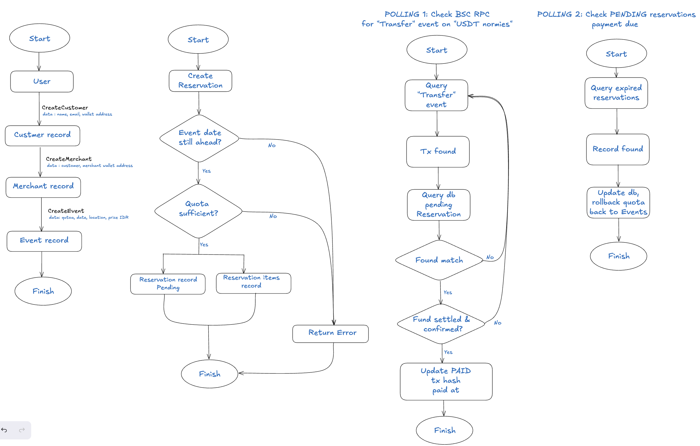

# Ticketing System Go REST API with Crypto Payment Validation (BSC Testnet) [main branch: DEV]


> Go REST API using **FIBER** (gofiber.io) and Crypto Payment Validation. This is for SerMorpheus Software Engineer Assessment.


## 💡 Why Fiber?

I come from Node JS for all my stacks, and after some research I found Fiber which is very similar to Express.js so that means it's more simpler, more modular and familiar for me compared to Gin to work on. It's fast, and very lightweight in terms of memory usage.

All deployment is using Railway, 

### 💡 Assumptions
The ticketing system is assumed to be some kind of **Ticketing Marketplace**, where:

	1. There are Merchants.
	2. There are two types of Customers, one is regular customer (who buys) and 
	    the other is merchant owner (who sells). For the purpose of this assessment, sellers
		have one-to-one relationship with their wallet addresses. Later, we should implement
		one-to-many between customers and wallets.
	3. Merchant can create events, with predefined ticket type, ticket price, date, and quota
	4. Customer/buyers can purchase more than one event's tickets in a single purchase
	5. In the assessment guides, stated "A valid transaction will reduce the ticket 
	    quota by the purchased amount.". But, to better handle race-condition scenarios,
	    on user purchase, quantity is directly deducted and treated as 'Pending
	    Reservation'.
	6. Once customer made payment (which later validated through polling), then we can
	    determine whether quota is successfully paid, or, rolled back to available quota.
	7. Currency conversions between price in USD and IDR uses external API, and with the
	    assumption where 1 fiat USD === 1 $USDT (never depegs).
	8. Payment Verification implements hybrid system : POLLING and MANUAL CONFIRMATION. 
	    Details to be explained below.
---



## ENV
```
DB_HOST=crossover.proxy.rlwy.net
DB_PORT=19895
DB_NAME=railway
DB_USER=postgres
DB_PASS=NoYbZJXQNODCRWKvmRmeyexLRfvEuadM
SSL_MODE=disable
EXCHANGE_RATES_API_KEY=94bb708b5963b2b9ee364fe9
EXCHANGE_RATE_URL=https://v6.exchangerate-api.com/v6/94bb708b5963b2b9ee364fe9/pair/USD/IDR
ETHERSCAN_API_KEY=V73FC241WQ8W3R6RR6V3JPCS9XGM8XK7E2
```
## API Reference

#### Create Customer
```http
POST /customers
```
**Request Body:**
```json
{
  "name": "SELLER",
  "email": "SELLER@example.com",
  "wallet_address": "0x753dfc03b4d37b3a316d0fe5ab9f677c0d3c20f8"
}
```

#### Get All Customers
```http
GET /customers
```

#### Get Customer by ID
```http
GET /customers/:id
```
| Parameter | Type     | Description                      |
| :-------- | :------- | :------------------------------- |
| `id`      | `string` | **Required**. ID of the customer |

#### Create Merchant
```http
POST /merchants
```
**Request Body:**
```json
{
  "merchant_owner_id": 2,
  "merchant_name": "TiketKita Festival Organizer",
  "merchant_wallet": "0x753dFC03b4d37B3a316D0Fe5aB9F677C0D3C20f8",
  "merchant_type": "Event Organizer"
}
```

#### Get All Merchants
```http
GET /merchants
```

#### Get Merchant by ID
```http
GET /merchants/:id
```
| Parameter | Type     | Description                      |
| :-------- | :------- | :------------------------------- |
| `id`      | `string` | **Required**. ID of the merchant |

#### Update Merchant
```http
PATCH /merchants/:id
```
| Parameter | Type     | Description                      |
| :-------- | :------- | :------------------------------- |
| `id`      | `string` | **Required**. ID of the merchant |

#### Create Event
```http
POST /events
```
**Request Body:**
```json
{
  "event_name": "ETHEREUM 10 YEARS",
  "event_date": "2025-08-15T00:00:00Z",
  "event_time": "2025-08-15T19:00:00Z",
  "event_venue": "Plenary Hall, Jakarta Convention Center",
  "event_geolocation": "-6.2184,106.8013",
  "event_description": "2 Days camp",
  "merchant_id": 1,
  "price_idr": 20000,
  "event_ticket_amount": 13
}
```

#### Get All Events
```http
GET /events
```

#### Get Event by ID
```http
GET /events/:id
```
| Parameter | Type     | Description                  |
| :-------- | :------- | :--------------------------- |
| `id`      | `string` | **Required**. ID of the event |

#### Create Reservation
```http
POST /reservations
```
**Request Body Example (multiple items supported):**
```json
{
  "user_id": 3,
  "items": [
    {
      "event_id": 1,
      "ticket_qty": 2
    },
    {
      "event_id": 2,
      "ticket_qty": 1
    }
  ]
}
```

#### Get All Reservations
```http
GET /reservations
```

#### Get Reservation by ID
```http
GET /reservations/:id
```
| Parameter | Type     | Description                     |
| :-------- | :------- | :------------------------------ |
| `id`      | `string` | **Required**. ID of reservation |

#### Manual Reservation Verification
```http
POST /reservations/manual-verification
```
**Request Body:**
```json
{
  "reservation_id": 1,
  "transaction_hash": "0x1234567890123456789012345678901234567890123456789012345678901234"
}
```

#### Update Reservation
```http
PATCH /reservations
```


## 📦 Stacks

| Feature               | Description |
|----------------------|-------------|
| 💳 Framework     | Fiber - Express-like go framework for APIs |
| 🧩 Database      | Postgresql |
| 📊 ORM| gorm |
| 🔐 Chain   | BSC Testnet |
| 💲 USDT Contract| 0xCD60747D9Bbb1da2AfB2F834391f0FF6ccb15f1a |
| 🧠 Lisk Chain Integration | Fast finality, low fees, and EVM compatibility. |

---

---

## Project Structure

```
├── .env.example - Environment variables template
├── .gitignore
├── bin/ - Compiled binaries
│   └── listener
├── cmd/ - Main application entry points
│   └── listener/
│       └── main.go
├── helpers/ - Helper functions and utilities
│   ├── bscscan.go
│   ├── listener.go
├── main.go - Main application file
├── migrations/ - Database migration scripts
│   └── migrateAll.go
├── models/ - Data models
│   ├── Customers.go
│   ├── Events.go
│   ├── Merchants.go
│   └── Reservations.go
├── routes/ - API route handlers
│   ├── customer_routes.go
│   ├── event_routes.go
│   ├── merchant_routes.go
│   └── reservation_routes.go
├── storage/ - Database storage implementations
│   └── postgres.go
├── workers/ - Background workers
│   └── poller.go
```


## 🔥 Local Development

## Prerequisites

Before getting started, ensure you have the following installed:

- [Go](https://go.dev/doc/install) (version 1.20 or higher)
- [PostgreSQL](https://www.postgresql.org/download/) (version 12 or higher) and [psql](https://www.postgresql.org/docs/current/app-psql.html) 
- [gorm](gorm.io/gorm)
- [Etherscan API KEY](https://etherscan.io/)
- [exchangerate-api](https://v6.exchangerate-api.com/v6/94bb708b5963b2b9ee364fe9/pair/USD/IDR)
- [Git](https://git-scm.com/downloads)


📧 Email: [reinhartsams@gmail.com]  
🐦 Twitter: [@reyyn_hart]  
💬 Telegram: [t.me/reinhartsamuel]  

---

✨ **Omnium** – Where simplicity meets power in crypto payments.  
🚀 Accept IDRX today. On Lisk. For everyone.

